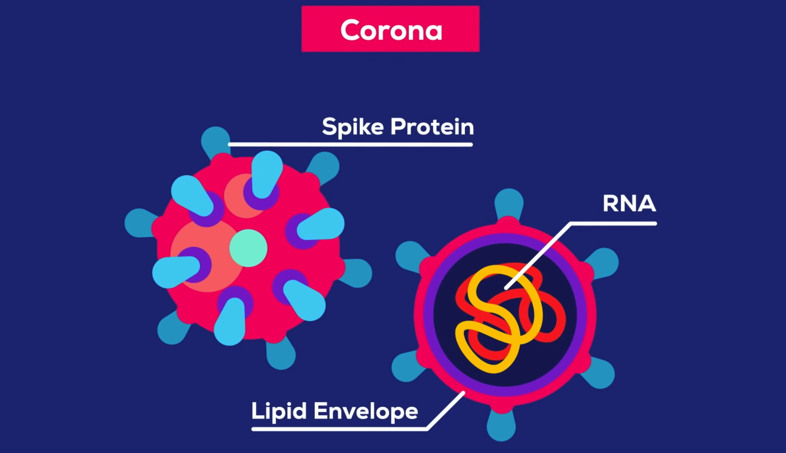

# PPSUS

This repository compromises processes and resources that are used to develop the PPSUS project.

### Related Articles

- Artificial Neural Network to Predict Structure-based Protein-protein Free Energy of Binding from Rosetta-calculated Properties(doi:10.26434/chemrxiv-2022-zhd87) -> `binding_energy_experiments`

# About the repository

With the emergency of the COVID-19 pandemic, there is a growing need for rapid testing to accelerate the isolation process and contain the spread of the disease. Hence, new approaches to testing are being developed, experimented, and enhanced. In this proejct, it's explored Machine Learning along with the Protein Computational Drawing state-of-the-art software called Rosetta can be applied to help the development of COVID-19 diagnose testing. The full PPSUS project is divided in the following steps:

- [x]  Gather protein data 
- [ ] Binding Energy
	- [x]  Develop a protein-protein interaction free energy of binding predictor
	- [ ]  Build an automated Machine Learning pipeline for the protein-protein interaction free energy of binding predictor
	- [ ]  Deploy a protein-protein interaction free energy of binding predictor
- [ ] Solubility
	- [ ]  Develop a protein solubility predictor
- [ ] Docking
	- [ ]  Develop a protein docking predictor

## Team
### CNS Lab

Computational Natural Science Lab is a Research Group founded by professors and students of CESAR School University to explore and search about topics related to computational biology.

### FIOCRUZ
Oswaldo Cruz Foundation (Fiocruz) is health and social development institute dedicated to generate and disseminate scientific and technological knowledge backed by the Brazilian Ministry of Health.

### Members

- José Cláudio Soares Neto(jcsn@cesar.school)
- Erico Souza Teixeira(est@cesar.school)
